<div align="center">

# 📊 Descriptive Statistics — Employee Dataset

*Workforce analysis using statistical measures & Python*

<br/>

[](https://www.python.org/)
[](https://pandas.pydata.org/)
[](https://jupyter.org/)
[](https://opensource.org/licenses/MIT)

</div>

> A concise case study analyzing 50 employee records using descriptive statistics to uncover workforce patterns in age, salary, and lifestyle scores.

## 📈 Key Findings

| Metric | Mean | Median | Range |
|--------|------|--------|-------|
| Age | 31.88 yrs | 30 yrs | 22–62 yrs |
| Salary | ₹2,027 | ₹1,950 | ₹556–₹4,969 |
| Healthy Eating | 4.92/10 | — | 1–9 |
| Active Lifestyle | 5.90/10 | — | 1–10 |

## 🔍 Analysis Covered
**Central Tendency · Dispersion · Group Analysis · Visualization**

## 📂 Dataset

| Column | Type | Description |
|--------|------|-------------|
| Employee_ID | int | Unique ID |
| Blood_Group | str | A/B/AB/O |
| Age | int | Years (22–62) |
| Salary | float | Annual (₹) |
| Healthy_Eating_Score | int | 1–9 scale |
| Active_Lifestyle_Score | int | 1–10 scale |

## 📊 Visual Analysis

<div align="center">
  <table border="0">
    <tr>
      <td align="center"><b>Salary Distribution</b><br/>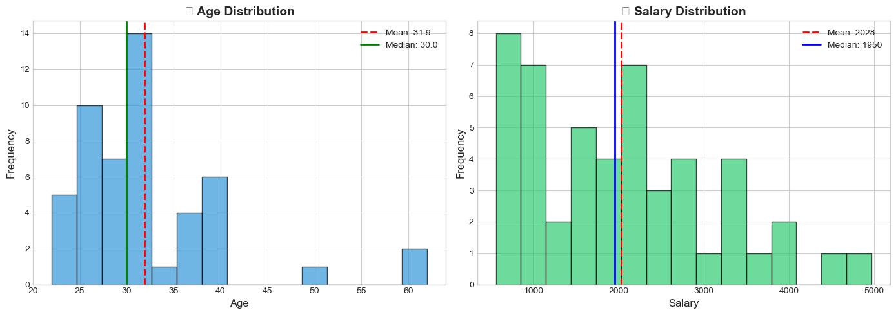</td>
      <td align="center"><b>Group Comparison</b><br/>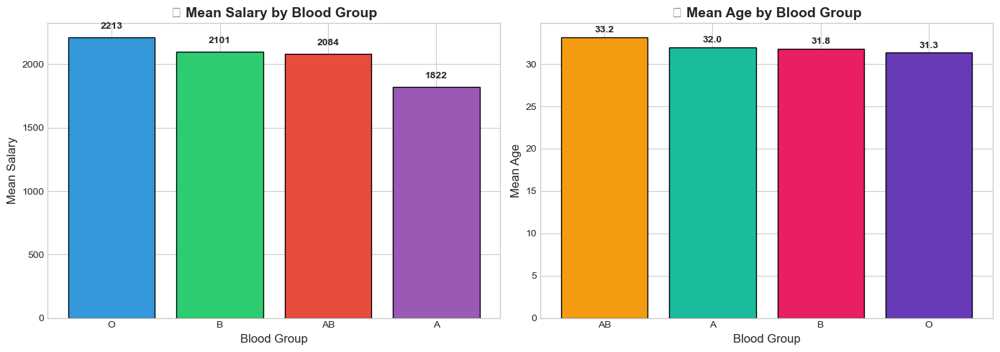</td>
    </tr>
    <tr>
      <td align="center"><b>Score Proportions</b><br/>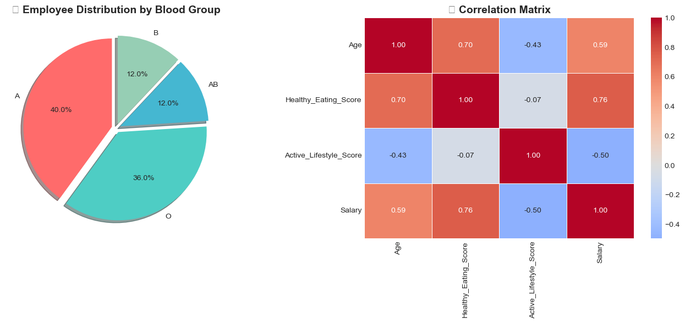</td>
      <td align="center"><b>Outlier Analysis</b><br/>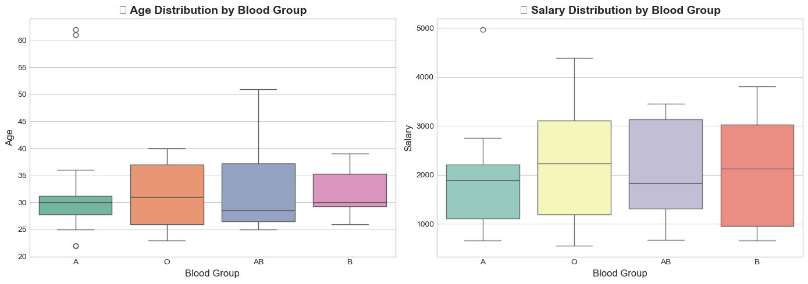</td>
    </tr>
  </table>
</div>

## 📸 Project Showcase

<div align="center">

| | |
|:---:|:---:|
| 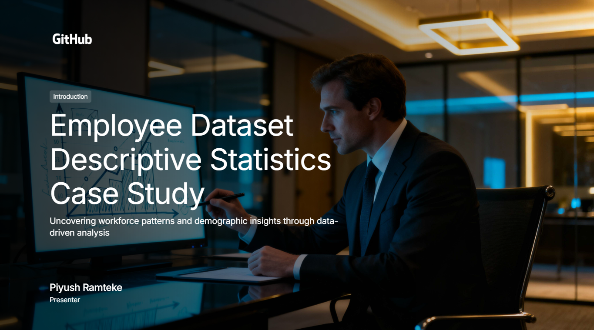 | 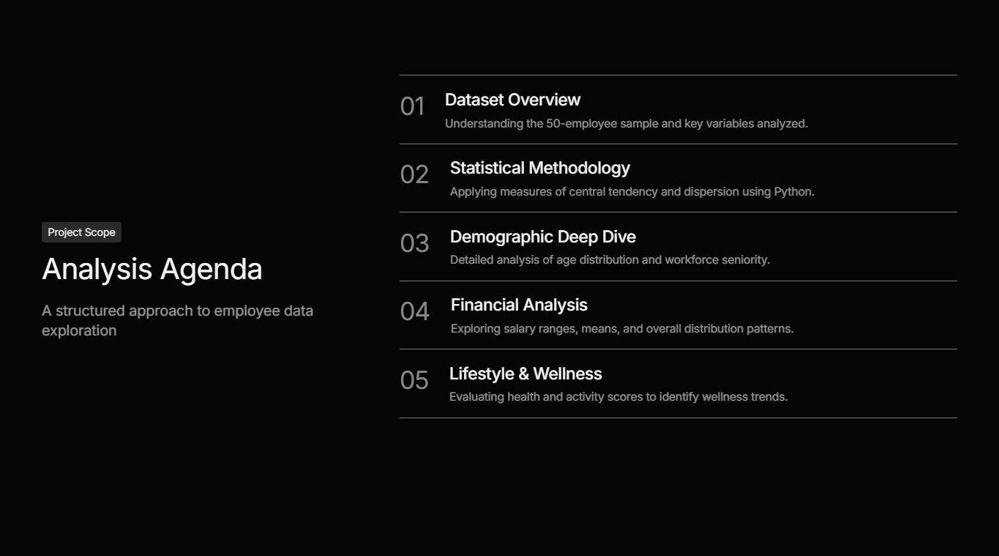 |
|  | 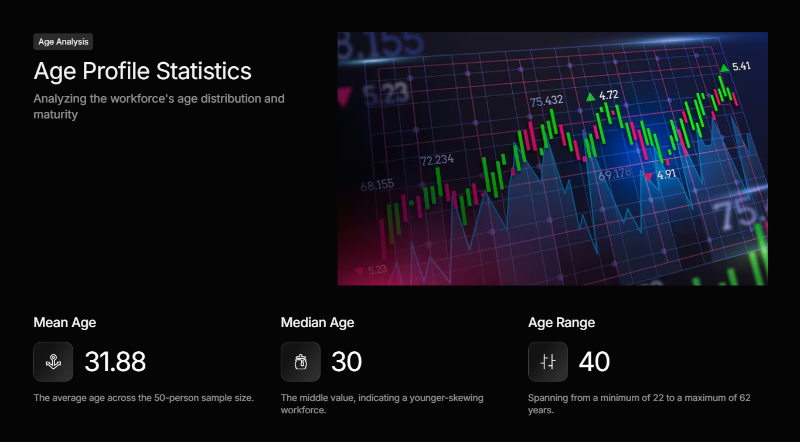 |
| 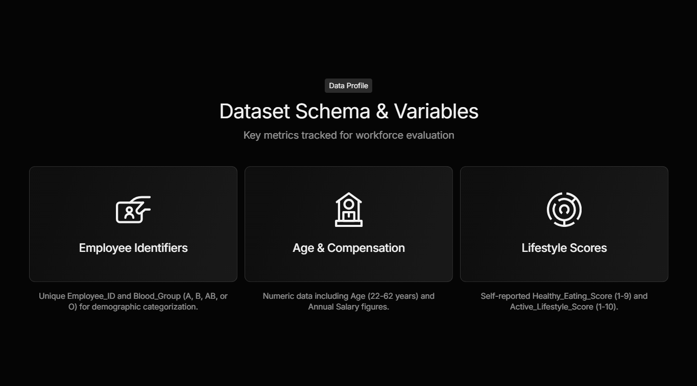 | 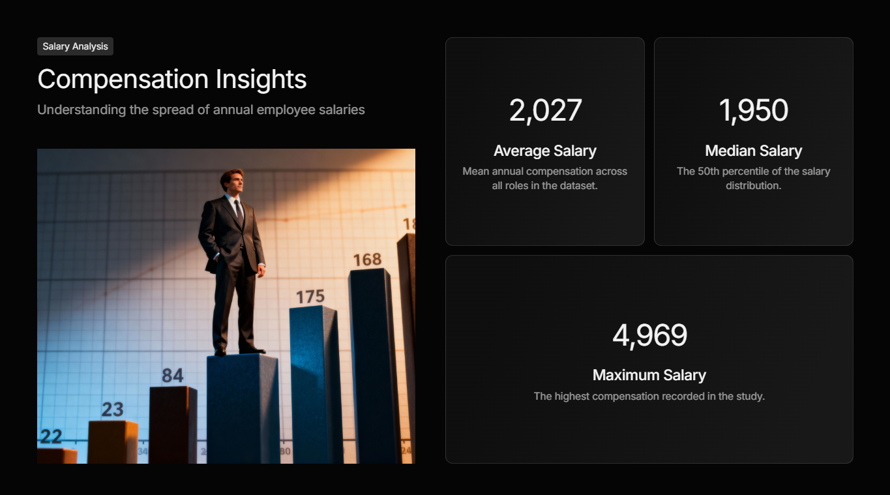 |
| 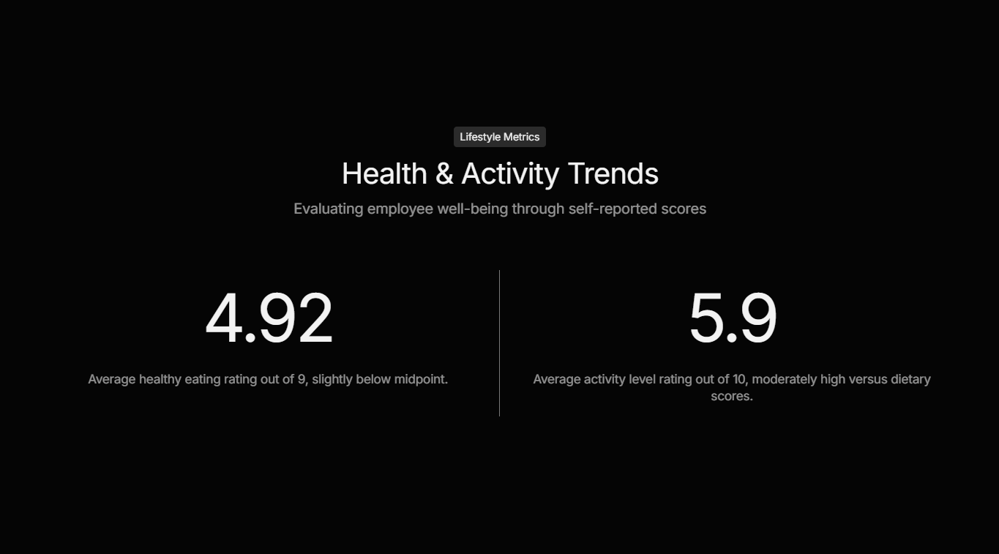 | 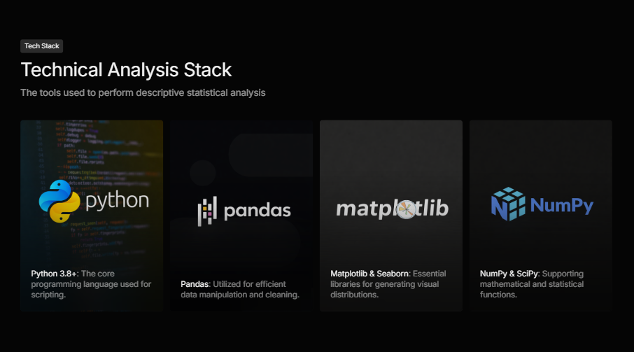 |
| 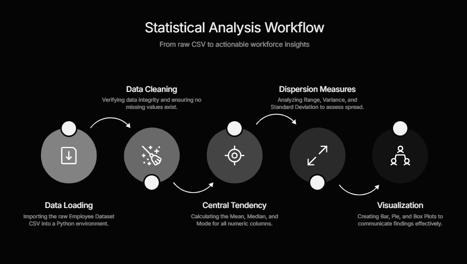 | 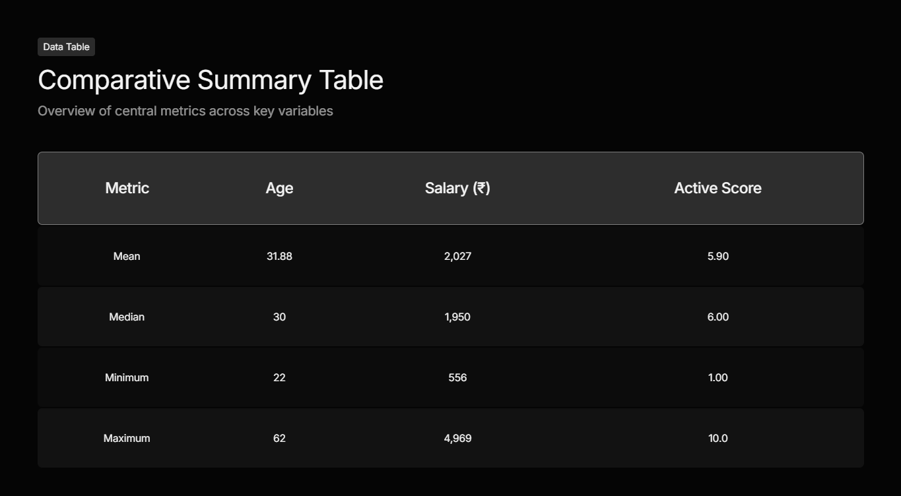 |
| 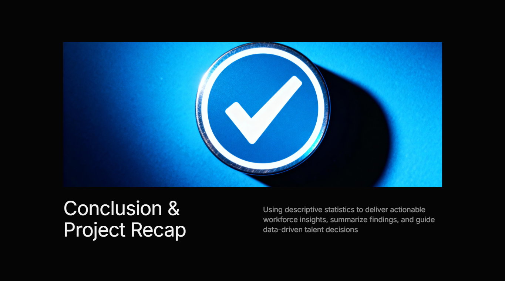 | 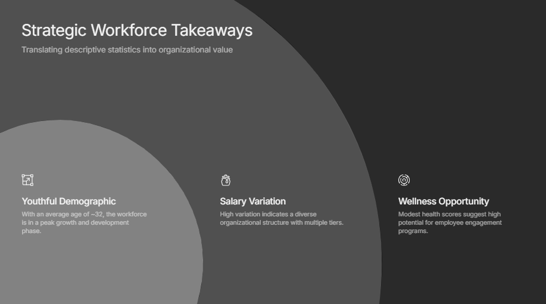 |

</div>

## 🛠️ Tech Stack
**Python · Pandas · NumPy · Matplotlib · Seaborn · SciPy**

## 🚀 How to Run

```bash
git clone https://github.com/Piyu242005/Descriptive-Statistics-Case-Study-on-Employee-Dataset.git
pip install pandas numpy matplotlib seaborn scipy
jupyter notebook Descriptive_Statistics_Case_Study.ipynb
```

## 📁 Project Structure

```
├── Descriptive_Statistics_Case_Study.ipynb
├── Employee Dataset.csv
├── Employee Dataset Descriptive Statistics Case Study.pdf
├── ScreenShot/
└── README.md
```

## 📌 Conclusions

* Young workforce (avg ~32 years)
* High salary variance → diverse roles
* Health scores suggest wellness program opportunity
* Clean dataset, no missing values

## 👨‍💻 Author

**Piyush Ramteke**  
[@Piyu242005](https://github.com/Piyu242005) · [LinkedIn](https://linkedin.com/in/piyush-ramteke) · piyu.143247@gmail.com

---
⭐ Star this repo · MIT License · March 2026
